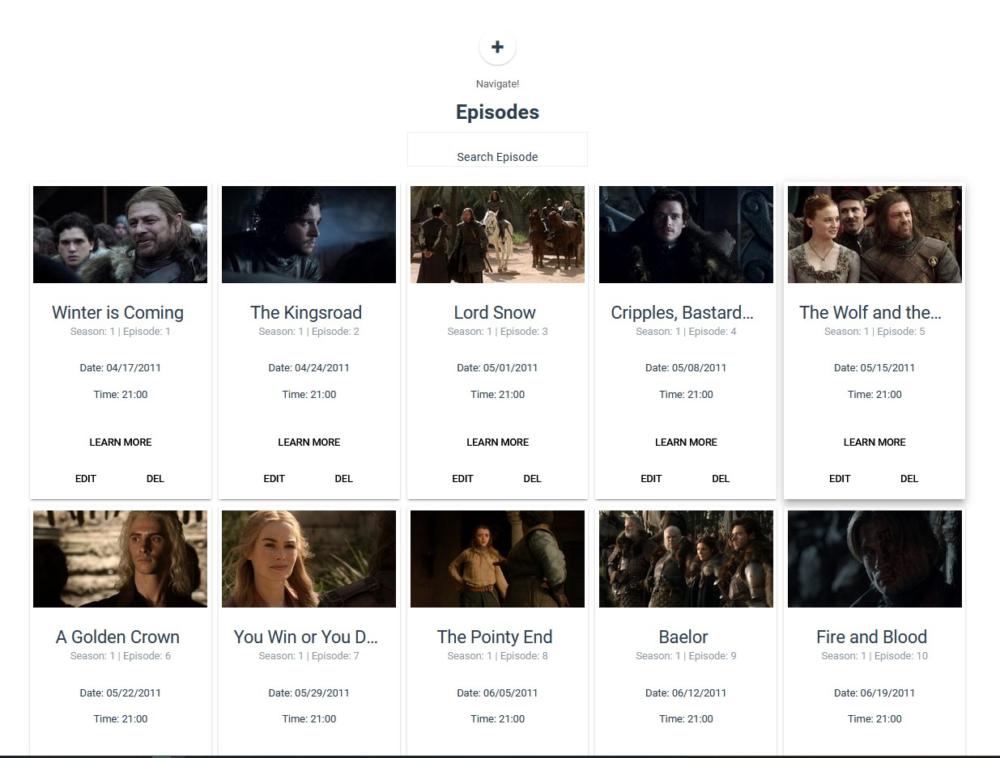
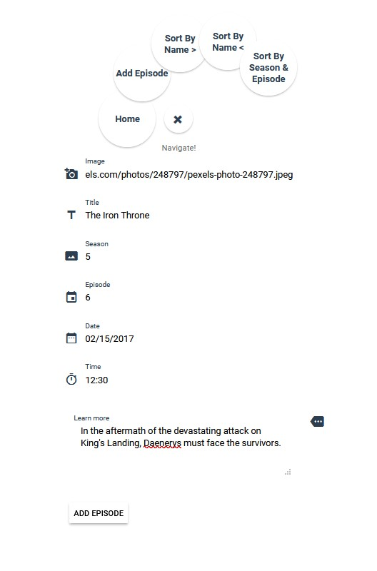
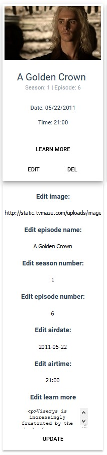
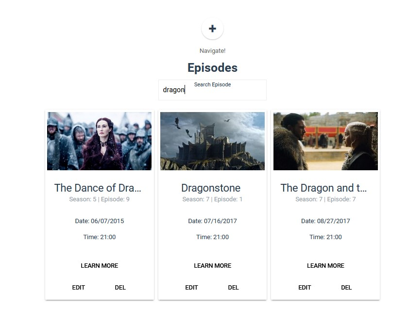
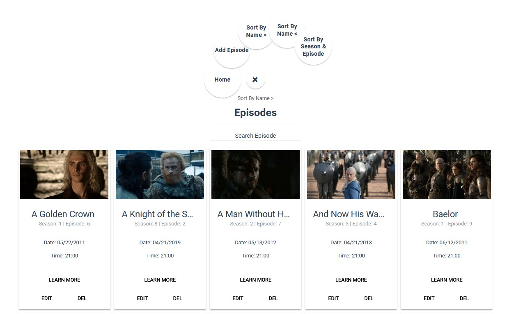
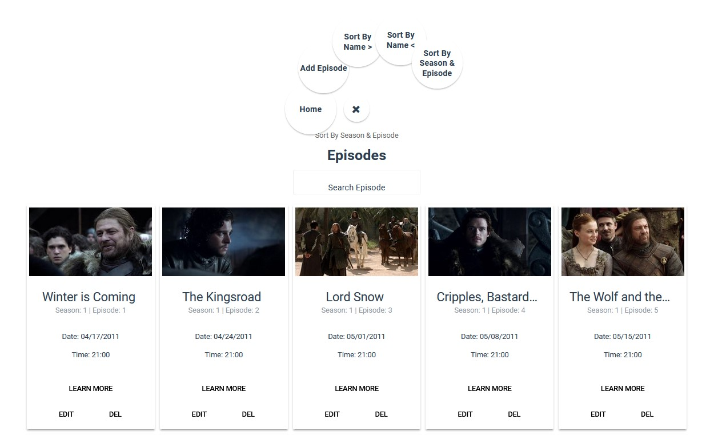

# Game of Thrones App

A VueJS application that uses Axios and JSON Server to simulate database requests. It is a complete CRUD app, allowing you not only to Create, Read, Update and Delete Game of Thrones episodes but also search for a particular episode, sort all episodes by name in both ascending and descending order as well as sort them by season and episode. All data is read and saved in a JSON file, meaning the changes are permanent.

Functionality:

## Add episode

## Edit and delete an episode

## Search by name

## Sort by episode name - both in ascending and descending order

## Sort by season and episode

